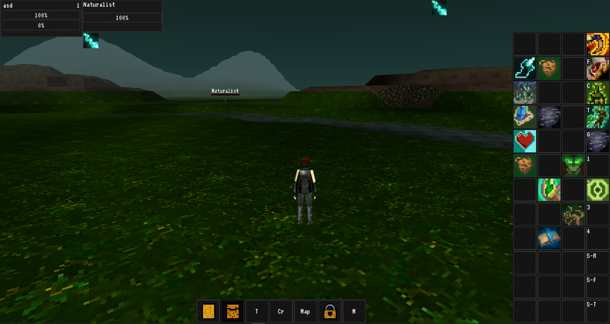

# Broken Seals

### The project requires a few custom engine modules to run! read the Editing the game part!

Keep in mind, that most of the work went into the engine modules so far, and the style itself.

A 3D third person RPG. With both multiplayer, and singleplayer capabilities.

The main gameplay-loop goal is to create an experience with enough complexity and depth, that can rival the more old-school MMO- and action rpgs, because nowadays I feel like that is something that got lost.

I want the game to run on every platform, without sacrificing from the gameplay. From the testing I've done this is not even an issue.

This game (with the engine modules) was ported from unity, because it kind of hit the limits of that engine. (Not rendering-wise)

* Basically imagine having about 20 assembly definitions, a main assembly definition, which are just a bunch of interfaces, and everything 
* dependency-injecting itself into it, and still having a 30-ish second compile time, while constantly running into unfixable bugs, and 
* having to work around "simple" problems, like implementing a networking solution on top of LLAPI. Alone.

And the reason for me to tell you is:

-Implementing spells did not get too much priority in this version, meaning like half of them doesn't work at all.
-In the other version I tried to have bindings for controllers, so that they can use lots of spells, it works, and it's not bad at all, but it's not yet implemented into this one. (It was pretty much implemented as bindable control keys)
-Sounds were not implemented at all yet.
-With the graphics I only worked to get the style itself right.

Except for these features however, this version is way more advanced, than the unity one! c++, and godot conventions allowed me to change the code design into something that is pretty much on an another level feature-potential wise.

So it will not take long to implement most if the missing features themselves, as the basic scaffolding is there already.

Now all of these will get higher priority.

## Screenshots

Note: Before going open source I removed the assets which was derived from paid stuff, which means the game doesn't look like this anymore.
The new textures will need to be cleaned up / improved. It will be done soon. I'll change the screenshots when that's done.
The reason to use these screens is to convey the style I'm going for.

## Editing the game

Firstly I recommend, that you grab the addons from: 

https://github.com/Relintai/entity-spell-system-addons.git

And place them in game/addons.

* The new (wip) setup script will do this automatically!
* The ai editor addon is half-baked right now, you don't need to enable that.
* And the PropTool leaks a little amount of memory, it will be fixed soon.

If you just want to try the game, grab the editor executable from releases, and open the project with that, or if you want to compile godot yourself go to the Compiling section.

## Project architecture

This is the main game, it has scripts so compiling, and setting up the engine is really easy.

These scripts worked well enough for me, but they are not good enough now.

I'll work on a better solution to replace the engine setup scripts. (Top priority)
This will happen in the next few days.

(I'll not use git submodules, as I've been bitten already by them, I'm thinking about a scons script, as you already need scons for compiling godot.)

To be able to open this project you will need a few engine modules compiled into godot, namely:

https://github.com/Relintai/world_generator.git
https://github.com/Relintai/entity_spell_system.git
https://github.com/Relintai/ui_extensions.git
https://github.com/Relintai/voxelman.git
https://github.com/Relintai/texture_packer.git
https://github.com/Relintai/godot_fastnoise.git

These modules should be more like core modules. Game specific c++ features will go to a different module. I'll set it up soon.

## Compiling

Either:

Run `EngineSetup.bat` on windows, or `engine_setup.sh` on linux/osx. These scripts will clone godot, and the required engine modules, and they'll copy them to the proper folders.

And then just compile godot as usual. Note I have a bunch of scripts to do it in the root of the project, just select the one you need.

[Official docs for compiling GODOT](https://docs.godotengine.org/en/latest/development/compiling/index.html)

If you run the setup scripts again, they'll just pull, from the repositories.

Or:

Clone Godot, and install the modules mentioned in the Project architecture section, and compile as usual.

