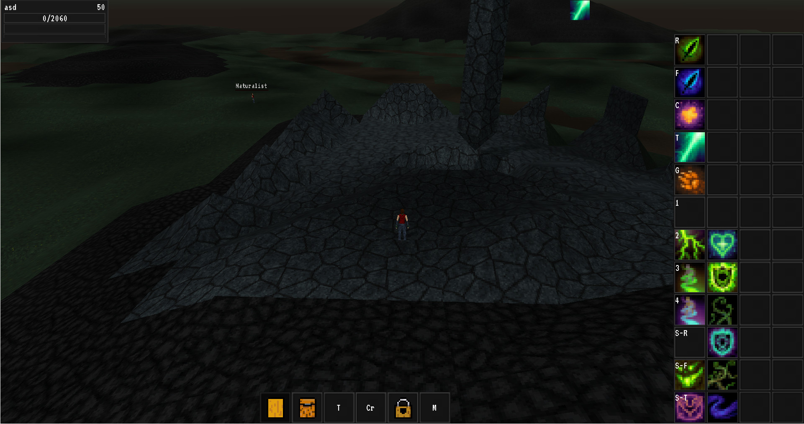

# Broken Seals

### In order to open the game project in Godot, you need a custom build Godot editor! [See](#editing-the-game)



A 3D third person RPG. With both multiplayer, and singleplayer capabilities.

The main gameplay-loop goal is to create an experience with enough complexity and depth, that can rival the more old-school MMO- and action rpgs, because nowadays I feel like that is something that got lost.

I want the game to run on every platform, without sacrificing from the gameplay. From the testing I've done this is not even an issue.

## Editing the game

In order for you to open the game in the editor you will need a custom built version, with a few engine modules built int, 
and unfortunately for now, you will need to build it yourself. (Binary releases will be available eventually!)

But don't worry, Godot is surpisingly easy and hassle free to compile! [See](#compiling)

After you have the engine with the required modules, you can go ahead, run it, and just open the project inside the `game` folder.

Usually after the initial import it will need a restart, however everything should work after that.

## The required engine modules

These are the required engine modules, they are listed here for completeness`s sake, the project's setup script will install these for you automatically
int the [Compiling](#compiling) section.

https://github.com/Relintai/world_generator.git

https://github.com/Relintai/entity_spell_system.git

https://github.com/Relintai/ui_extensions.git

https://github.com/Relintai/voxelman.git

https://github.com/Relintai/texture_packer.git

https://github.com/Relintai/godot_fastnoise.git

https://github.com/Relintai/mesh_data_resource.git

https://github.com/Relintai/procedural_animations.git

https://github.com/Relintai/props.git

https://github.com/Relintai/mesh_utils.git

https://github.com/Relintai/broken_seals_module.git

https://github.com/Relintai/thread_pool.git

## Compiling

First make sure, that you have everything installed to be able to compile the engine. See: [Official docs for compiling GODOT](https://docs.godotengine.org/en/latest/development/compiling/index.html)

Now let's clone this repository:

``` scons ```

Before compiling, in the project's folder just run scons, it will set every dependency up. Like:

``` git clone https://github.com/Relintai/broken_seals ```

cd into the new folder:

``` cd broken_seals ```

Now let's run the project's setup script, by calling scons without arguments.

``` scons ```

This will clone and setup the engine, and all of the required modules into a new engine folder inside the project, using http.

(If you want to use the github's ssh links append `repository_type=ssh` like ``` scons repository_type=ssh ```)

Once it is done you can compile the engine, either by going into the engine folder and following the 
[official docs](https://docs.godotengine.org/en/latest/development/compiling/index.html), or by using build words without changing directories. 
(These are inspired by how pacman works.)

Once the build finished you can find the editor executable inside the `./engine/bin/` folder, but you can also run it using the provided `editor.sh`,
or `editor.bat` (These will create a copy, so you can compile while the editor is running). 

### Build words

The project's setup script now contains support for "build words".

For example to build the editor for windows with 4 threads you can use:

``` scons bew -j4 ```

The first argument must start with b (build), then it needs to be followed by a few abbreviations (the order does not matters)

The rest of the arguments will be passed directly to godot's scons script.

#### Editor

Append `e` to build with `tools=yes` a.k.a the editor.

``` scons bew -j4 ```

if you omit `e`, the system will build the export template for you. For example:

``` scons bw -j4 ```

This will be the `release_debug` windows export template.

#### Platform abbreviations

`l`: linux
`w`: windows
`a`: android
`j`: Javascript
`i`: iphone (Not yet finished, use `build_ios.sh`, and `build_ios_release.sh`)
Mac OSX: Not yet finished, use `build_osx.sh`


#### Target abbreviations

By default ther system builds in release_debug.

Append `d` for debug, and `r` for release.

``` scons bewd -j4 ```

build editor windows debug

``` scons bwr -j4 ```

build windows release (this will build the windows release export template)

#### Shared modules

Note: This only works on linux!

append `s` to the build string. 

Optionally you can also make the build system only build a target module, by appending one of these:

`E`: Entity Spell System
`T`: Texture Packer
`V`: Voxelman
`W`: World Generator
`P`: Procedural Animations

Example:

``` scons belsE -j4 ```

build editor linux shared (Entity Spell System) with 4 threads

Note: to easily run the editor while it's build like this, you can use the editor.sh in the root of the project.

#### Scons cache, and sdk locations

Unfortunately the sdk locations and the scons cache location is hardcoded atm, as I kind of forgot about it. This will be fixed very soon.

In the meantime you can always just go into the engine directory,

``` cd engine ```

and compile godot using the [official docs](https://docs.godotengine.org/en/latest/development/compiling/).

## Pulling upstream changes

After you pull changes, just run `scons`, it will update the dependencies.

## Upgrading the modules

Note: this is how to update the HEADS file. Normally you don't need to do this.

If you want to update the modules, and the engine to the latest, you can use (`action=update`):

``` scons a=u ``` 

You can also update different targets: `all`, `engine`, `modules`, `all_addons`, `addons`, `third_party_addons`

For example to update the engine to the latest: ``` scons a=u target=engine ```