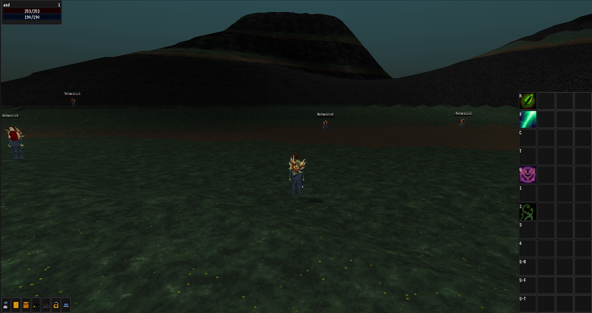
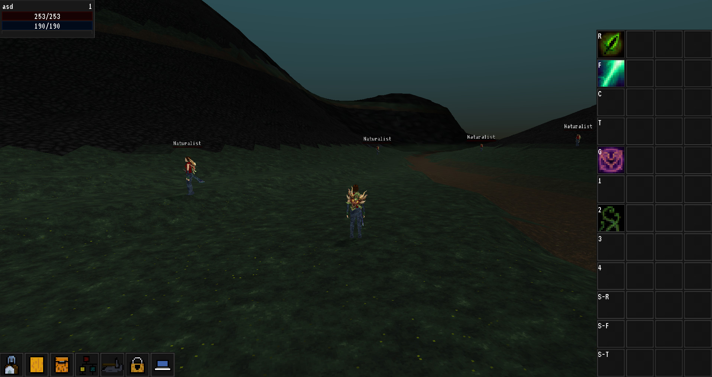

# Broken Seals

A 3D third person RPG. With both multiplayer, and singleplayer capabilities.

The main gameplay-loop goal is to create an experience with enough complexity and depth, that can rival the more old-school MMO- and action rpgs, because nowadays I feel like that is something that got lost.

I want the game to run on every platform, but the game design is PC first. From the testing I've done this is not going to be an issue.

#### On Desktop



#### On Touchscreens



## Editing the game

In order for you to open the game in the editor you will need a custom built version, with a few engine modules built in.

You can check the releases tab to grab one, but since the project still changes a lot on the c++ side,
if you get it there, also get the relevant game project.

At the moment I don't have nightlies, I do plan on setting up something that could create them (github actions maybe?) eventually.

If you want to use master, you will need to build the project yourself for now, but don't worry, Godot is surpisingly easy and 
hassle free to compile! [See here.](#compiling)

After you have the engine with the required modules, you can go ahead, and just open the project inside the `game` folder.

Usually after the initial import it will need a restart, however everything should work after that.

## The required engine modules

These are the required engine modules, they are listed here for completeness`s sake, the project's setup script will install these for you automatically! See the [Compiling](#compiling) section.

https://github.com/Relintai/world_generator.git \
https://github.com/Relintai/entity_spell_system.git \
https://github.com/Relintai/ui_extensions.git \
https://github.com/Relintai/voxelman.git \
https://github.com/Relintai/texture_packer.git \
https://github.com/Relintai/godot_fastnoise.git \
https://github.com/Relintai/mesh_data_resource.git \
https://github.com/Relintai/procedural_animations.git \
https://github.com/Relintai/props.git \
https://github.com/Relintai/mesh_utils.git \
https://github.com/Relintai/broken_seals_module.git \
https://github.com/Relintai/thread_pool.git

## Compiling

First make sure, that you have everything installed to be able to compile the engine. See: See the [official docs for compiling Godot](https://docs.godotengine.org/en/latest/development/compiling/index.html) for more info.

Now let's clone this repository:

``` git clone https://github.com/Relintai/broken_seals ```

cd into the new folder:

``` cd broken_seals ```

Now let's run the project's setup script, by calling scons without arguments.

``` scons ```

This will clone and setup the engine, and all of the required modules into a new `engine` folder inside the project, using http.

(If you want to use the github's ssh links append `repository_type=ssh` like ``` scons repository_type=ssh ```)

Once it is done you can compile the engine, either by going into the engine folder and following the 
[official docs](https://docs.godotengine.org/en/latest/development/compiling/index.html), or by using [build words](#build-words) without changing directories.

Once the build finishes you can find the editor executable inside the `./engine/bin/` folder, but you can also run it using the provided `editor.sh`,
or `editor.bat` (These will create a copy, so you can compile while the editor is running). 

### Build words

The project's setup script contains support for "build words". These can be used from the root of this project.

For example to build the editor for windows with 4 threads you can use:

``` scons bew -j4 ```

The first argument must start with b (build), then it needs to be followed by a few abbreviations (the order does not matters)

The rest of the arguments will be passed directly to godot's scons script.

#### Editor

Append `e` to build with `tools=yes` a.k.a. the editor.

``` scons bew -j4 ```

if you omit `e`, the system will build the export template for you. For example:

``` scons bw -j4 ```

This will be the `release_debug` windows export template.

#### Platform abbreviations

`l`: linux \
`w`: windows \
`a`: android \
`j`: Javascript \
`i`: iphone (Not yet finished, use `build_ios.sh`, and `build_ios_release.sh`) \
Mac OSX: Not yet finished, use `build_osx.sh`

#### Target abbreviations

By default the system builds in release_debug.

Append `d` for debug, or `r` for release.

``` scons bewd -j4 ```

build editor windows debug

``` scons bwr -j4 ```

build windows release (this will build the windows release export template)

#### Shared modules

Note: This only works on linux!

append `s` to the build string. 

Optionally you can also make the build system only build a target module, by appending one of these:

`E`: Entity Spell System \
`T`: Texture Packer \
`V`: Voxelman \
`W`: World Generator \
`P`: Procedural Animations

Example:

``` scons belsE -j4 ```

build editor linux shared (Entity Spell System) with 4 threads

Note: to easily run the editor you can use the `editor.sh` or `editor.bat` in the root of the project.

#### Other

Append `v` to pass the `vsproj=yes` parameter to the build script. This will generate Visual Studio project files.

#### Postfixes

There are a few postfixes for the build words. These are more complex options. You have to append them to your build word with an underscore.

You can use as many as you want.

For example:

``` scons bel_slim_latomic -j4 ```

##### slim

With this postfix you can build a slimmed down version of the engine. This disables quite a few unneeded modules.

``` scons bel_slim -j4 ```

##### latomic

If you get linker errors while building the game/editor about undefined referenced with atomic related functions you can use this postfix.
It will add the ` -latomic ` command line switch to the linker flags.

I ran into this issue while building on a raspberry pi 4 with the x11 platform. It might be related to the recent reworks to threading.

``` scons bel_latomic -j4 ```

##### strip

Appends `debug_symbols=no` to the build command, which will strip the resulting binary from debug symbols.

``` scons bel_strip -j4 ```

#### Patches

The build script can apply optional patches. They work similarly to build words, except this time the word has to start with p, and then it has to be followed by the desired patch characters.

Like `scons ps`

They will not create new commits to the engine, so they can easily be removed.

##### SkeletonEditor

To apply the SkeletonEditor patch append s after the p, like `scons ps`.

This is a patch made from the skeleton editor backport. See: https://github.com/TokageItLab/godot/commits/pose-edit-mode-fixedup and 
https://github.com/godotengine/godot/pull/45699

#### Scons cache, and sdk locations

In order to use scons cache and to tell the build system where some of the required sdks are located you usually 
have to use environment variables. Most of the time you might just want to add them globally, 
howewer this is sometimes unfeasible (e.g. you don't have administrator access, or you just want to have
multiple sdk versions installed).

In order to solve this a build config file was added.

If you want to use the config simply rename the provided `build.config.example` to `build.config`, and customize 
the settings inside.

## Pulling upstream changes

First pull the changes by calling

``` git pull orgin master ```

Then just run `scons`, to will update the modules.

## Upgrading the modules

Note: this is how to update the HEADS file. Normally you don't need to do this.

If you want to update the modules, and the engine to the latest, you can use (`action=update`):

``` scons a=u ``` 

You can also update different targets: `all`, `engine`, `modules`, `all_addons`, `addons`, `third_party_addons`

For example to update the engine to the latest: ``` scons a=u target=engine ```