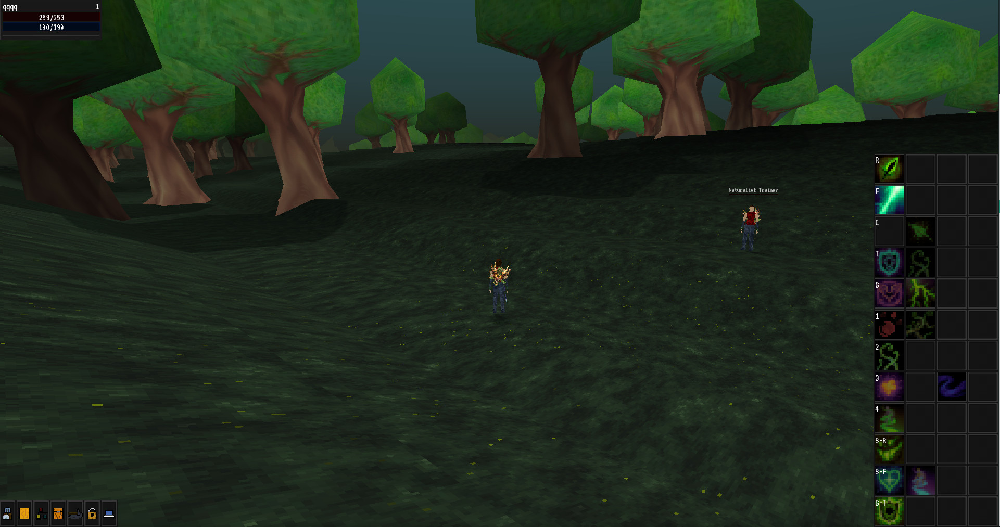
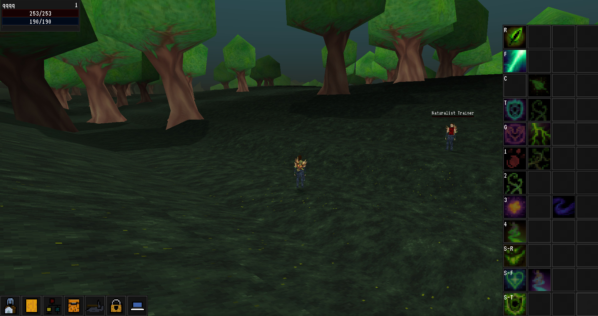

# Broken Seals

A 3D third person RPG. With both multiplayer, and singleplayer capabilities.

The main gameplay-loop goal is to create an experience with enough complexity and depth, that can rival the more old-school MMO- and action rpgs, because nowadays I feel like that is something that got lost.

I want the game to run on every platform, but the game design is PC first. From the testing I've done this is not going to be an issue.

This project now uses the , which is my custom version of godot.

The project also requires the presence of some of my engine modules, Pandemonium contains all of them. See [here](https://github.com/Relintai/pandemonium_engine/tree/master/modules).

You can get binaries under the releases tab [here](https://github.com/Relintai/broken_seals/releases).\
You can also try a live version running in the browser [here](https://relintai.github.io/broken_seals/).

Unfortunately the web editor needs custom http headers to work and I can't set that up from github.io, so right now I don't have a hosted version of that.

#### On Desktop



#### On Touchscreens



## Status 

On the technical side almost everything has been set up the way I think will work in long term. \
Improvements will be needed obviously, but I don't expect core reworks anymore for the forseable future.\
[Here's a list of some of the more prominent features](#features).

Currently I'm working to finish / make the content creation tools usable without any issues.

The Mesh Data Resource Editor will need the most amount of work by far, as it needs some of it's core tools implemented.
The rest only needs undo-redo to fix most of their remaining usability issues.

Character mesh generation, and it's setup will probably get refinements soon, after the mesh data resource editor 
editor plugin is done, as it definitely needs some work. This might require some api changes, other than this 
I don't expect big changes anymore.

I only have a minimum amount of content, only enugh to figure out things like look, colors, style, and technical stuff etc.
I'll start working on it properly after the content creation tools are done. \
Hopefully it won't take long to have something that's actually playable.

Note that things like the spell system already has most of the required core features for even complex spells,
which might be strange at first sight, especially if you know agile development. This is because this project
was originally developed in unity (for about 3 years), and then eventually due to constant issues, bugs,
and annoyances I ported it to godot (while fixing the design issues that I was forced to do because of c# / unity).
Then eventually I went open source with it. Since I already had a prototype that let me mess with classes for a while, 
I decided to just focus on the technical stuff, and make that as good as I can first.

## Features

### Content creation tools

Note: I'm currently focusing on these.

- World Generator: It contains resources that can handle world generation, and an interface for easy editing. Needs undo redo.
- Mat Maker GD: [RodZill4's Material Maker](https://github.com/RodZill4/material-maker) ported to the cpu. Needs undo redo, and about 60 nodes.
- Mesh Data Resource Editor: Needs some core features (Like mesh face creation, deletion, edge split, merge etc). Also needs undo redo.

I also have these added to the project.

- Color palette addon from https://github.com/EricEzaM/godot-color-palette 
- Godoxel addon (An in godot image editor.) from https://github.com/aaronfranke/GraphicsEditor

### Multiplayer

Multiplayer was broken for quite a while, so currently it has a lot more bugs than it used to.
Most of these should be relativelty easy to fix.

- Authoritative server implementation. (Except for movement. Can be done though, I'll do it eventually, but it's usual for these kind of games to not have authoritative movement.)
- You can create, and join to servers.
- Movement works. Although the animations are not yet implemented for client players.
- Targeting works.
- Spell casting works. Although auras have some issues for now.
- Inventory management should work.
- Stuff like vendors, trainers should all work. I think except for crafting (I think just some methods need to be marked as RPCs, and they might need to need to call eachother via rpcs).

### Characters

- Main and secondary stats all work, they are also customizable in the project settings. They also have built in maint stat -> secondary stat conversion support.
- Character resources all work and scriptable. (Like health, mana, speed, energy etc) Also you can dynamically add it and remove it from a character.
- Tab targeting support.
- Spells, and auras are fully scriptable, and networked.
- Actionbar, actionbar profiles support.
- Spell learning support.
- Talent support, with multiple talent trees.
- Loot.
- Equipment support including weapons, clothes, and also other attachments. Although starter gear support is not yet finished.
- Support for changing clothes via texture merging.
- Support for changing parts of models via clothes. Also support for alternative bodyparts.
- Character models are using merged meshes and textures, with generated LOD. (This is also multi threaded, with fallback when no threads are available.) This system is using MeshDataResources.
- Generic attach point support for the character skeletons. (Spell cast particle effects, spell effects, also the same system can be used for weapons.)
- Interaction support.
- Vendors, Trainers, Crafting.
- Fully scriptable ai support.
- Control over characters can be easily changed by the server, and the character bodies are scripted to act accordingly automatically. For example mind control effects can be implemented with this system.

Missing:

- Character customization support (like selecting hairtyles). It's mostly there, but some crucial features are still missing.
- Temporary character model change support. Think of polymorph effects, toys etc. Needs the character customization support first.

### Terrain

- Multi threaded chunk generation. It will even work when no threads are available, also in this case the work gets distributed over multiple frames (although one of the steps is a bit too long, so it still needs some tweaks).
- Prop system. You can serialize scenes into a more efficient format than scene files. These can contain lights, meshes, rooms and portals, etc. The system is scriptable. Scene hierarchies also work.
- PropInstance node, which can mesh and put props into the scene.
- Per chunk material support, even for props.
- Terraman: prop support, even with mesh (and texture) merging. If you look at the trees on the screenshot, they are merged together per chunk, and they all share the material, and shader. Also if you serialize lights into props, they are added as vertex lights.
- Terraman and PropInstance: Vertex light support. You can add vertex lights (via code, or the prop system), and the meshes will be colored with it.
- Terraman: Vertex colors are also used to achieve the main style. (RAO).
- Terraman: Vertex color based ambient occlusion support.
- Terraman and PropInstance: LOD support, even for prop meshes.
- Terraman and PropInstance: LOD generation is scriptable.
- Dungeon generation support via a separate prop based system. Dungeons are generated below ground, with teleporters to them. Also support for turning off the terrain engine while the player is inside a dungeon.
- Procedural world generation. [See here](#terrain-generation).

### UI

- Menu and game ui.
- Actionbars with keybind support. Also the icons that you drag to the actionbar actually gets merged into the ui's texture to reduce drawcalls.
- Character, talent, spellbook, crafting, inventory, loot, vendor, trainer windows are all implemented.
- Easily scriptable options dialog.
- The menu has full support for keyboard / controller navigation. (The game itself misses it at the moment though.)
- Touchscreen controls. It will also make the buttons bigger if it detects a touchscreen.
- Keybind window.
- About window.

## Project overview

As stated in the opening section the project uses a custom version of the godot engine.

The project's workflow has been set up so you can easily compile this version for yourself if you want to.

See the [Compiling](#compiling) section if you want to know how to do this.

### Engine

Currently the [Pandemonium Engine](https://github.com/Relintai/pandemonium_engine) is used as the engine for this project,
which is a heavily customized verison of the [Godot game engine](https://godotengine.org/). It's based on the 3.x branch. 

It contains my engine modules, and also it got significanlty slimmed down compared to vanilla Godot.

For a more in-depth changelog see it's changelog file [here](https://github.com/Relintai/pandemonium_engine/blob/master/CHANGELOG.md).

### Game

The [/game](https://github.com/Relintai/broken_seals/tree/master/game) folder contains the game's code and assets.
This is the folder you are supposed to open in the editor.

The game's folder structure should be (hopefully) mostly self explanatory.

#### Game Modules

I designed the game's code to be highly modular, so I created a [loader module](https://github.com/Relintai/broken_seals/tree/master/game/scripts/game_modules). \
It will look for files named ` game_module.tres ` and call methods on them on certain events.\
This system uses the [DataManager](https://github.com/Relintai/broken_seals/blob/master/game/scripts/game_modules/DataManager.gd) singleton.

For example this is how the ui initializes itself:

The player's [body](https://github.com/Relintai/broken_seals/blob/master/game/player/Body.gd) script requests the ui nodes from the [DataManager](https://github.com/Relintai/broken_seals/blob/master/game/scripts/game_modules/DataManager.gd) singleton (like ` var ui = DataManager.request_instance(DataManager.PLAYER_UI_INSTANCE) `). And then the data manager will instance it's ` player_ui ` scene, and call all module's ` on_request_instance ` methods, while also passing the newly instanced scene to them.

These module scripts are also responsible for collecting all spells and then setting them into the ESS singleton, so they are actually castable.

This is the [module](https://github.com/Relintai/broken_seals/blob/master/game/modules/entity_classes/naturalist/game_module.tres) for the naturalist, and it's [ResourceDB](https://github.com/Relintai/broken_seals/blob/master/game/modules/entity_classes/naturalist/resource_db.tres), which will be merged into a central resource db for ESS. 

Note that the module resources are sorted by their resource paths, so spells should always get the same id, on every platform every time.
This is to optimize networkd spell casts.

Most of the game assets ended up under the modules folder [here](https://github.com/Relintai/broken_seals/tree/master/game/modules) for this reason,
however these might get moved, if I find a better arrangement.

#### Terrain generation

The terrain generation is now handled by the new [world_generator](https://github.com/Relintai/broken_seals/tree/master/game/addons/world_generator)
addon. 

Right now the terrain is only going to be pseudo-random, as generating proper connected worlds are kind of super difficult,
especially if you also have to mesh them in 3d. \
I think this solution can be extended later to be able to do a full continent / world randomization / generation. 

For now the idea is that we have a World resource, this contains Continents, those zontain Zones, and those contain SubZones.

The position and size is predetermined by the designer. And then when a chunk needs to be generated it gets put into this world, and then these generate it's data.

- World does mostly nothing on it's own for now, except for holding continents.
- Continents handle things like oceans, and big mountains.
- Zones generate proper terrain, and add props. They need to blend into continents.
- SubZones can be used as spawners, prop spawners, or they can even do terrain modifications.

So when a chunk needs to be generated, first the world gets it, then all continents which intersect with it's position,
then all zones which intersect with it's position, then all subzones which intersect with it's position.

The editor contains an addon to help with editing the world.

## Editing the game

Grab the engine itself, and then open the project inside the `game` folder.

After the initial import it might need an editor restart, however everything should work after that.

If you want to use master, you will likely need to build the editor for it if the c++ side had breaking changes since the last release.

## Compiling

First make sure, that you have everything installed to be able to compile the engine. 
See the [official docs for compiling Godot](https://docs.godotengine.org/en/3.4/development/compiling/index.html) for more info. 
My setup/compile script uses the same tools, so you don't need to install anything else.

Even though the project doesn't use godot anymore, their docs are still sufficient.

Now let's clone this repository:

``` git clone https://github.com/Relintai/broken_seals ```

cd into the new folder:

``` cd broken_seals ```

Now let's run the project's setup script, by calling scons without arguments.

``` scons ```

This will clone and setup the engine, and all of the required modules into a new `engine` folder inside the project, using http.

(If you want to use the github's ssh links append `repository_type=ssh` like ``` scons repository_type=ssh ```)

Once it is done you can compile the engine.

To build the editor on windows with 4 threads run the following command:

``` scons bew -j4 ```

To build the editor on linux with 4 threads run the following command:

``` scons bel -j4 ```

I call this feature of the setup script build words. [See](#build-words).

Once the build finishes you can find the editor executable inside the `./engine/bin/` folder.

For convenience there is a provided `editor.sh`, or `editor.bat` for running it from the project's folder.
These will create a copy, so you can even compile while the editor is running.

Alternatively if you don't want to use build words, you can also just go into the engine folder:

``` cd engine ```

And compile godot as per the [official docs](https://docs.godotengine.org/en/latest/development/compiling/index.html).

### Build words

The project's setup script contains support for "build words". These can be used from the root of this project.

For example to build the editor for windows with 4 threads you can use:

``` scons bew -j4 ```

The first argument must start with b (build), then it needs to be followed by a few abbreviations (the order does not matters)

The rest of the arguments will be passed directly to godot's scons script.

#### Editor

Append `e` to build with `tools=yes` a.k.a. the editor.

``` scons bew -j4 ```

if you omit `e`, the system will build the export template for you. For example:

``` scons bw -j4 ```

This will be the `release_debug` windows export template.

#### Platform abbreviations

`l`: linux \
`w`: windows \
`a`: android \
`j`: Javascript \
`i`: iphone (Not yet finished, use `build_ios.sh`, and `build_ios_release.sh`) \
Mac OSX: Not yet finished, use `build_osx.sh`

#### Target abbreviations

By default the system builds in release_debug.

Append `d` for debug, or `r` for release.

``` scons bewd -j4 ```

build editor windows debug

``` scons bwr -j4 ```

build windows release (this will build the windows release export template)

#### Shared modules

Note: This only works on linux!

append `s` to the build string. 

Optionally you can also make the build system only build a target module, by appending one of these:

`E`: Entity Spell System \
`T`: Texture Packer \
`V`: Voxelman \
`W`: World Generator \
`P`: Procedural Animations

Example:

``` scons belsE -j4 ```

build editor linux shared (Entity Spell System) with 4 threads

Note: to easily run the editor you can use the `editor.sh` or `editor.bat` in the root of the project.

#### Other

Append `v` to pass the `vsproj=yes` parameter to the build script. This will generate Visual Studio project files.\
Append `c` to pass the `compiledb=yes` parameter to the build script. This is a new feature in 3.x to have this disabled by default to lessen compile times.

#### Postfixes

There are a few postfixes for the build words. These are more complex options. You have to append them to your build word with an underscore.

You can use as many as you want.

For example:

``` scons bel_slim_latomic -j4 ```

##### slim

With this postfix you can build a slimmed down version of the engine. This disables quite a few unneeded modules.

``` scons bel_slim -j4 ```

##### latomic

If you get linker errors while building the game/editor about undefined referenced with atomic related functions you can use this postfix.
It will add the ` -latomic ` command line switch to the linker flags.

I ran into this issue while building on a raspberry pi 4 with the x11 platform. It might be related to the recent reworks to threading.

``` scons bel_latomic -j4 ```

##### strip

Appends `debug_symbols=no` to the build command, which will strip the resulting binary from debug symbols.

``` scons bel_strip -j4 ```

##### threads

Appends `threads_enabled=yes` to the build command. Useful for building the editor for html.

``` scons bej_threads -j4 ```

#### Scons cache, and sdk locations

In order to use scons cache and to tell the build system where some of the required sdks are located you usually 
have to use environment variables. Most of the time you might just want to add them globally, 
howewer this is sometimes unfeasible (e.g. you don't have administrator access, or you just want to have
multiple sdk versions installed).

In order to solve this a build config file was added.

If you want to use the config simply rename the provided `build.config.example` to `build.config`, and customize 
the settings inside.

### Manual Setup

If you you don't want to use the setup script (or just want to know what it actually does), 
this section will explain how to set everything up manually.

First clone the engine:

``` git clone https://github.com/Relintai/pandemonium_engine ```

Now if you look at the [HEADS file](https://github.com/Relintai/broken_seals/blob/master/HEADS).

It contains the commit hashes for that particular revision for every module and the engine.
The engine now contains all the modules, so at the moment only worry about the engine's commit hash.

You need to go and checkout the proper commit for it.

Now you can go ahead and compile the engine normally.

## Pulling upstream changes

First pull the changes by calling

``` git pull orgin master ```

Then just run `scons`, to will update the modules.

## Upgrading the modules

Note: this is how to update the HEADS file. Normally you don't need to do this.

If you want to update the modules, and the engine to the latest, you can use (`action=update`):

``` scons a=u ``` 

You can also update different targets: `all`, `engine`, `modules`, `all_addons`, `addons`, `third_party_addons`

For example to update the engine to the latest: ``` scons a=u target=engine ```
